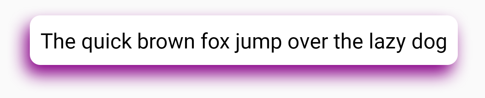
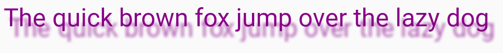

# ShadowLayout a css like shadow for android

Have you ever wanted a CSS type of shadow in your Android project ? No?! Me neither but designers
keep using it and the death flag is triggered when the app isn't a copy of the design. So, there it goes.

It do much more than casting a shadow so the name can be inaccurate. Internally, it uses the native 
`ScriptIntrinsicBlur` render script so it can easily blur the whole layout like the
[Blurry](https://github.com/wasabeef/Blurry) library.

# Requirements

Android 5.+ (API 21)

# Usage

```xml
<fr.orandja.shadowlayout.ShadowLayout
    android:padding="8dp"
    android:layout_gravity="center"
    android:layout_width="wrap_content"
    android:layout_height="wrap_content"
    android:background="@drawable/round_corners"
    app:shadow_radius="8"
    app:shadow_x_shift="-1dp"
    app:shadow_y_shift="2dp"
    app:shadow_downscale="1"
    app:shadow_color="#808"
    app:shadow_with_foreground="true"
    app:shadow_with_color="false"
    app:shadow_with_dpi_scale="true"
    app:shadow_with_css_scale="true">

    <androidx.appcompat.widget.AppCompatTextView
        android:layout_width="wrap_content"
        android:layout_height="wrap_content"
        android:textColor="@color/black"
        android:text="The quick brown fox jump over the lazy dog"
        android:textSize="16sp" />

</fr.orandja.shadowlayout.ShadowLayout>
```



## Parameters

Default value in parenthesis

- `shadow_radius` (6f) The radius of the gaussian blur in float. See #Rules of downscaling section to see how it works. 
- `shadow_x_shift` (0dp) Shift on the horizontal axis in dp
- `shadow_y_shift` (0dp) Shift on the vertical axis in dp
- `shadow_color` (#33000000) Color of the casted shadow
- `shadow_downscale` (1f) Downscale of the internal bitmap that render the shadow. The higher the downscale, the lower in size is the bitmap. At 2, the size of bitmap is halved. 
- `shadow_with_foreground` (true) Draw the actual view on top of the shadow.
- `shadow_with_color` (false) Keep all the subview colors in the blur. Coupled with `shadow_with_foreground` at false, a blur image can be render on screen.
- `shadow_with_dpi_scale` (true) Downscale the internal bitmap by the current smartphone dpi. A 100dp view will result in a 100px bitmap. 
- `shadow_with_css_scale` (true) Downscale by 5/3 more. Because CSS shadow standard blur by a half more than the real blur size.


## Limitations

The default implementation of android gaussian blur (`ScriptIntrinsicBlur` render script) is limited to 25 pixels at max. 
To counter that, the layout downscale the real render of the view inside a bitmap (ALPHA_8 or RGBA with `shadow_with_color` at true). 
Then blur it. Then draw the blur inside the canvas. Then **redraw** the view in the canvas. (`shadow_with_foreground` at true)
It draw the view 2 times so it can be really expensive. 

The radius can mean multiple things depending on the configurations. 

## Rules of downscaling

When no downscale are applied:
 
```xml
<fr.orandja.shadowlayout.ShadowLayout
    app:shadow_radius="3f"
    app:shadow_downscale="1"
    app:shadow_with_dpi_scale="false"
    app:shadow_with_css_scale="false" />
```

The internal bitmap is the same size of the view. The radius is the number of **pixels** blured around.
With high dpi, it will be hard to the effect. However, in some cases, it can be usefull to have a nice looking blur at the expense of more memory.
The max radius is 25 pixels. The parameter `shadow_downscale` multiply the max radius by its value. So at shadow_downscale="2.5" it increases the max radius to 62.5f.

When `app:shadow_with_dpi_scale="true"`: Downscale the internal bitmap by the current smartphone dpi. A 100dp view will result in a 100px bitmap.
The radius means **dp**. It blurs up to 25dp.

When `app:shadow_with_css_scale="true"`: Same as dpi, it will add a 5/3 downscale to mimic the CSS shadow blur.

# Shadow anything

As said before since it draw the whole layout it can cast a shadow of anything. Like text:

```xml
    <fr.orandja.shadowlayout.ShadowLayout
        android:padding="8dp"
        android:layout_gravity="center"
        android:layout_width="wrap_content"
        android:layout_height="wrap_content"
        app:shadow_radius="1"
        app:shadow_x_shift="1dp"
        app:shadow_y_shift="2dp"
        app:shadow_downscale="1"
        app:shadow_color="#AA000000"
        app:shadow_with_foreground="true"
        app:shadow_with_color="true"
        app:shadow_with_css_scale="false"
        app:shadow_with_dpi_scale="true">

        <androidx.appcompat.widget.AppCompatTextView
            android:layout_width="wrap_content"
            android:layout_height="wrap_content"
            android:textColor="#808"
            android:text="The quick brown fox jump over the lazy dog"
            android:textSize="16sp" />

    </fr.orandja.shadowlayout.ShadowLayout>
```



Since `shadow_with_color` is at true, the drawn shadow is of the same color of the text rendered.
The color parameter only affect alpha. 
